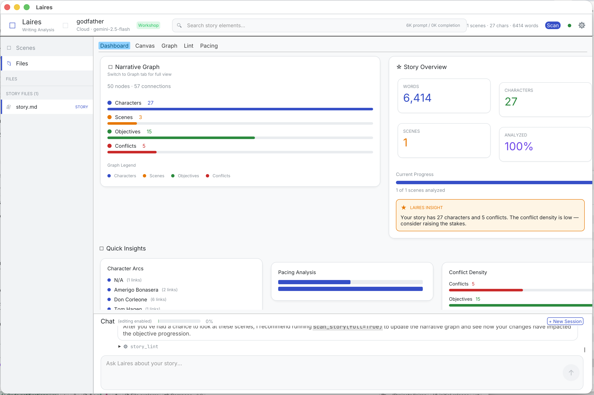
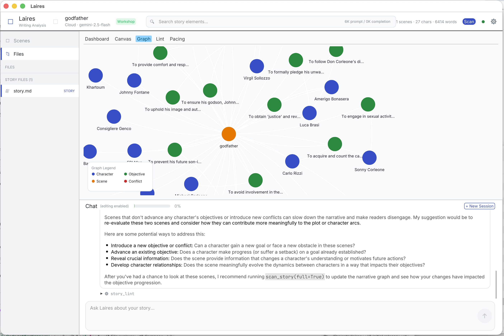

# Laires

[](https://github.com/justingibbs/laires/actions/workflows/ci.yml)
[](LICENSE)

What if you could `git diff` your plot? Laires treats your novel or screenplay like a codebase — it builds a **narrative graph** of characters, conflicts, and arcs from your manuscript, then gives you an LLM agent with 28 tools to query, lint, and co-edit your story.




## Why Laires?

Word processors know nothing about your story. They see paragraphs, not characters. Laires bridges the gap — it parses your manuscript into a structured model, then lets an AI agent reason about plot, consistency, and perspective using that structure. Think of it as IDE-level tooling for writing.

## Status

**Alpha** — functional and tested (225+ tests), but APIs may change. Feedback and contributions welcome.

## Features

- **Narrative graph** — Extracts characters, objectives, conflicts, and relationships into a structured, queryable graph
- **Native desktop GUI** — Single-binary desktop app with chat, canvas, scene sidebar, and force-directed graph visualization
- **Two operating modes** — *Consultant* for read-only analysis with revision briefs; *Workshop* for live co-editing
- **Multi-turn agent chat** — 28 built-in tools for querying the graph, searching text, running lint checks, analyzing pacing, and more
- **Character perspectives** — LLM-powered subjective interpretation of scenes through any character's eyes
- **Multi-file projects** — Novels, screenplays, or any multi-document project with automatic file discovery
- **Prose and Fountain** — Markdown prose and Fountain screenplay format, plus .docx import
- **Multiple LLM providers** — Anthropic, OpenAI, Gemini, Ollama, or any OpenAI-compatible endpoint
- **Consistency checking** — Lint rules and divergence detection to catch contradictions and plot holes
- **Custom skills** — Extend the agent with your own TOML-defined tools
- **VCS integration** — `laires diff` and `laires log` show narrative graph changes across git/jj commits

## Prerequisites

- [Rust toolchain](https://rustup.rs/) (1.85+, edition 2024)
- An LLM API key (Gemini, Anthropic, OpenAI, or a local model via Ollama)

## Installation

```bash
git clone https://github.com/justingibbs/laires.git && cd laires
cargo install --path .
```

## Quick start

```bash
# Create a project
mkdir my-novel && cd my-novel

# Add your API key
echo 'GEMINI_API_KEY=your-key-here' > .env

# Initialize
laires init --title "My Novel"

# Write your story in story.md, then analyze it
laires scan

# Explore
laires graph                    # print narrative graph summary
laires chat                     # interactive agent chat
laires gui                      # launch the desktop GUI
```

Separate scenes with Markdown headings (`## Chapter Title`) or horizontal rules (`---`). For screenplays, use `laires init --title "Title" --fountain` and standard Fountain scene headings (`INT. COFFEE SHOP - DAY`).

## Commands

| Command | Description |
|---------|-------------|
| `laires init --title "Title"` | Initialize a new project |
| `laires scan` | Analyze all scenes with the LLM |
| `laires graph` | Print narrative graph summary |
| `laires status` | Show project stats |
| `laires chat` | Interactive agent chat |
| `laires gui` | Native desktop GUI |
| `laires open` | Split-pane terminal UI with overlays |
| `laires lint` | Run consistency checks |
| `laires diff` | Graph changes since last commit |
| `laires perspective <char>` | View a scene through a character's eyes |
| `laires brief` | View or list revision briefs |
| `laires convert <file>` | Convert .docx/.txt to .md |

Run `laires --help` for full usage details.

## Configuration

The config file at `.laires/config.toml` is created by `laires init`:

```toml
[llm]
provider = "gemini"
model = "gemini-2.5-flash"
api_key_env = "GEMINI_API_KEY"
base_url = "https://generativelanguage.googleapis.com/v1beta/openai"

[project]
title = "My Novel"
format = "prose"

[analysis]
debounce_ms = 2000
auto_scan = true
```

### Supported providers

| Provider | `provider` value | `api_key_env` | `base_url` |
|----------|-----------------|---------------|------------|
| Google Gemini | `"gemini"` | `GEMINI_API_KEY` | `https://generativelanguage.googleapis.com/v1beta/openai` |
| Anthropic | `"anthropic"` | `ANTHROPIC_API_KEY` | `https://api.anthropic.com` |
| OpenAI | `"openai"` | `OPENAI_API_KEY` | `https://api.openai.com/v1` |
| Local (Ollama) | `"local"` | — | `http://localhost:11434/v1` |

## Architecture

Laires is built on the **Concept & Synchronization** pattern (Jackson & Meng, MIT CSAIL) — 10 independent concept modules coordinated through explicit synchronizations. See [docs/overview.md](docs/overview.md) for the full technical overview.

## Known limitations

- No streaming responses yet — the agent returns full replies after processing
- Graph visualization in the GUI is functional but basic (no arc overlays)
- Edition 2024 requires a recent Rust toolchain (1.85+)
- LLM analysis quality depends on the model — larger models produce better narrative graphs

## Development

```bash
cargo build              # build (debug)
cargo test               # run tests (~225 tests)
cargo fmt                # format code
cargo clippy             # lint
```

See [CONTRIBUTING.md](CONTRIBUTING.md) for guidelines on submitting changes.

## License

[MIT](LICENSE)
